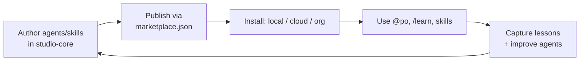

# claude-code-studio

> A Git-hosted **plugin marketplace** and **cross-project learning system** for
> [Claude Code](https://code.claude.com) — author agents and skills once, use them in
> every environment, and let them improve over time.

[](LICENSE)


`claude-code-studio` packages a set of Claude Code **agents**, **skills**, and
**commands** into one installable plugin (`studio-core`) and distributes it through a
marketplace, so the same tooling loads on your laptop and in every
[Claude Code on the web](https://code.claude.com/docs/en/claude-code-on-the-web) session
— no per-project copying. It also ships an **incremental-learning loop** so those agents
and skills accumulate knowledge across projects instead of starting cold each time.

---

## Features

- **One install, everywhere** — a single plugin bundles agents + skills + commands and
  loads in every local project and every cloud session.
- **A Product-Owner orchestrator (`po`)** that delegates to 8 specialist agents
  (planning, code-review, QA, security, devops, infra, docs, backlog), tiered by model
  to keep token spend low.
- **Incremental learning** that lands two ways: shared notes read at task start, and
  behavioral fixes baked into the agents themselves.
- **Self-extending** — when a recurring capability gap appears, `create-agent`
  scaffolds a new specialist and opens a draft PR.
- **Safe by default** — no secrets, hooks ship disabled, and all self-modifications go
  through PRs.

## How it works

A single plugin, `studio-core`, is published by this repo's marketplace catalog and
consumed via the channel that fits your account and environment. The learning loop is a
read → work → write-back cycle centered on a version-controlled knowledge base and the
agent files themselves. See **[docs/architecture.md](docs/architecture.md)** for the
full picture and diagrams.



## Quickstart

### Local (all your projects)

```bash
./scripts/install-local.sh
# or: claude plugin marketplace add nilpost/claude-code-studio
#     claude plugin install studio-core@claude-code-studio --scope user
```

Start a new session, then try `@po`, `/learn`, or any skill. User-scope install makes it
available in every local project. Pull updates later with `./scripts/update-studio.sh`.

### Cloud (Claude Code on the web)

Cloud containers are ephemeral, so "always on" has to come from a committed file. Run
this once per repo and commit the result — every future session of that repo then
auto-installs the plugin from the latest `main`:

```bash
./scripts/enable-in-repo.sh /path/to/your-repo
./scripts/enable-in-repo.sh /path/to/your-repo --push   # ...and commit + push it too
```

It merges into any existing `.claude/settings.json`, is safe to re-run, and is
self-contained — copy or `curl` just this one script and run it against any repo, no
studio checkout required. `--dry-run` previews. To do it by hand, copy
[`templates/consumer-settings.snippet.json`](templates/consumer-settings.snippet.json).
For all-repos or org-wide setups (Pro and Teams/Enterprise), see
**[docs/deploy-org-wide.md](docs/deploy-org-wide.md)**.

### Cloudflare MCP (optional add-on)

A second plugin, `cloudflare-mcp`, bundles Cloudflare's remote MCP servers (docs +
Workers bindings by default — see [`plugins/cloudflare-mcp/README.md`](plugins/cloudflare-mcp/README.md)
for the full server list) using the same local/cloud mechanism as `studio-core`.

```bash
claude plugin install cloudflare-mcp@claude-code-studio --scope user
```

For cloud, pass `--with-cloudflare` to `enable-in-repo.sh`, or merge the
`enabledPlugins` key from
[`templates/consumer-settings-cloudflare.snippet.json`](templates/consumer-settings-cloudflare.snippet.json)
into the repo's `.claude/settings.json`. Each Cloudflare server OAuths on first tool use
— no tokens stored in this repo.

## What's inside

| Component | What it does |
| --- | --- |
| `po` | Orchestrator: scopes a goal and delegates to specialists |
| `feature-planning`, `code-review`, `security` | Sonnet-tier, judgment-heavy specialists |
| `qa`, `backlog`, `devops`, `infra-admin`, `docs` | Haiku-tier, mechanical specialists |
| `recall-learnings` | Reads relevant past lessons before work starts |
| `capture-learnings` / `/learn` | Writes general lessons to `knowledge/LEARNINGS.md` |
| `improve-agent` / `/improve-agent` | Bakes a behavioral fix into a specific agent |
| `create-agent` / `/create-agent` | Scaffolds a new specialist agent → draft PR |

## Repository structure

```
.claude-plugin/marketplace.json      Marketplace catalog (lists both plugins)
plugins/studio-core/                 The main plugin (agents, skills, commands, hooks)
plugins/cloudflare-mcp/              Optional plugin: Cloudflare remote MCP servers
knowledge/LEARNINGS.md               Shared, version-controlled cross-project memory
templates/                           Copy/paste settings snippets for consumer repos
scripts/                             install-local · update-studio · enable-in-repo ·
                                     mirror-local · sync-learnings
docs/                                architecture · deploy-org-wide · updating
```

## Documentation

- **[Architecture](docs/architecture.md)** — design, diagrams, orchestration, learning loop
- **[Deploy always-on](docs/deploy-org-wide.md)** — Pro and Teams/Enterprise rollout
- **[Updating](docs/updating.md)** — how to pull the latest agents/skills into a session
- **[Contributing](CONTRIBUTING.md)** — add agents/skills, validate, PR conventions

## Prior art & credits

The learning loop follows the "learnings file → feedback → write-back" pattern from
[`haddock-development/claude-reflect-system`](https://github.com/haddock-development/claude-reflect-system).
For large ready-made agent/skill catalogs to draw from, see
[`wshobson/agents`](https://github.com/wshobson/agents),
[`jeremylongshore/claude-code-plugins-plus-skills`](https://github.com/jeremylongshore/claude-code-plugins-plus-skills),
and [`claude-market/marketplace`](https://github.com/claude-market/marketplace).
Mechanism reference: [plugin marketplaces](https://code.claude.com/docs/en/plugin-marketplaces) ·
[plugins](https://code.claude.com/docs/en/plugins) ·
[skills](https://code.claude.com/docs/en/skills) ·
[subagents](https://code.claude.com/docs/en/sub-agents).

## License

[MIT](LICENSE) © 2026 nilpost
