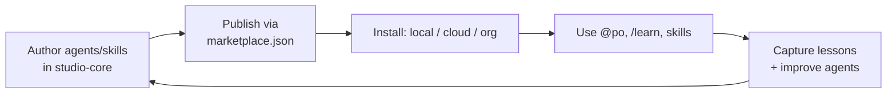

# claude-code-studio

> A Git-hosted **plugin marketplace** and **cross-project learning system** for
> [Claude Code](https://code.claude.com) — author agents and skills once, use them in
> every environment, and let them improve over time.

[](LICENSE)


`claude-code-studio` packages a set of Claude Code **agents**, **skills**, and
**commands** into one installable plugin (`studio-core`) and distributes it through a
marketplace, so the same tooling loads on your laptop and in every
[Claude Code on the web](https://code.claude.com/docs/en/claude-code-on-the-web) session
— no per-project copying. It also ships an **incremental-learning loop** so those agents
and skills accumulate knowledge across projects instead of starting cold each time.

---

## Features

- **One install, everywhere** — a single plugin bundles agents + skills + commands and
  loads in every local project and every cloud session.
- **A Product-Owner orchestrator (`po`)** that delegates to 8 specialist agents
  (planning, code-review, QA, security, devops, infra, docs, backlog), tiered by model
  to keep token spend low.
- **Incremental learning** that lands two ways: shared notes read at task start, and
  behavioral fixes baked into the agents themselves.
- **Self-extending** — when a recurring capability gap appears, `create-agent`
  scaffolds a new specialist and opens a draft PR.
- **An optional executive layer (`studio-exec`)** for running *several* projects as a
  governed portfolio — stage gates, a WIP limit, a token budget, and an independent
  assurance agent that verifies claimed status against reality.
- **Safe by default** — no secrets, the one hook enabled out of the box only ever
  reads (a background marketplace refresh, never a write), and all self-modifications
  go through PRs.

## How it works

A single plugin, `studio-core`, is published by this repo's marketplace catalog and
consumed via the channel that fits your account and environment. The learning loop is a
read → work → write-back cycle centered on a version-controlled knowledge base and the
agent files themselves. See **[docs/architecture.md](docs/architecture.md)** for the
full picture and diagrams.



## Quickstart

### Local (all your projects)

```bash
./scripts/install-local.sh
# or: claude plugin marketplace add nilpost/claude-code-studio
#     claude plugin install studio-core@claude-code-studio --scope user
```

Start a new session, then try `@po`, `/learn`, or any skill. User-scope install makes it
available in every local project. Pull updates later with `./scripts/update-studio.sh`.

### Cloud (Claude Code on the web)

Cloud containers are ephemeral, so "always on" has to come from a committed file. Run
this once per repo and commit the result — every future session of that repo then
auto-installs the plugin from the latest `main`:

```bash
./scripts/enable-in-repo.sh /path/to/your-repo
./scripts/enable-in-repo.sh /path/to/your-repo --push   # ...and commit + push it too
```

It merges into any existing `.claude/settings.json`, is safe to re-run, and is
self-contained — copy or `curl` just this one script and run it against any repo, no
studio checkout required. `--dry-run` previews. To do it by hand, copy
[`templates/consumer-settings.snippet.json`](templates/consumer-settings.snippet.json).
For all-repos or org-wide setups (Pro and Teams/Enterprise), see
**[docs/deploy-org-wide.md](docs/deploy-org-wide.md)**.

### Cloudflare MCP (optional add-on)

A second plugin, `cloudflare-mcp`, depends on Cloudflare's own official plugin
(`cloudflare@cloudflare`, from their [`cloudflare/skills`](https://github.com/cloudflare/skills)
marketplace) so it installs automatically wherever this one is enabled — see
[`plugins/cloudflare-mcp/README.md`](plugins/cloudflare-mcp/README.md) for what that
gets you and why it's a dependency rather than a hand-copied server list.

```bash
claude plugin marketplace add cloudflare/skills          # one-time prerequisite
claude plugin install cloudflare-mcp@claude-code-studio --scope user
```

For cloud, pass `--with-cloudflare` to `enable-in-repo.sh`, or merge the
`enabledPlugins` key from
[`templates/consumer-settings-cloudflare.snippet.json`](templates/consumer-settings-cloudflare.snippet.json)
into the repo's `.claude/settings.json` — either way, the `cloudflare/skills`
marketplace still needs to be added once in that environment (see the plugin's own
README) for the dependency to resolve. Each Cloudflare server OAuths on first tool use
— no tokens stored in this repo.

### Google Sheets MCP (optional add-on)

A third plugin, `google-sheets-mcp`, adds Google's own official remote MCP server for
Google Sheets (`sheetsmcp.googleapis.com`) — read/write cells, formulas, and sheet
structure. Same shape as `cloudflare-mcp`: a single publicly-documented vendor endpoint,
per-user OAuth on first tool use, nothing to install or store here. See
[`plugins/google-sheets-mcp/README.md`](plugins/google-sheets-mcp/README.md) for how it
was verified and what scopes it requests.

```bash
claude plugin install google-sheets-mcp@claude-code-studio --scope user
```

### Synology NAS MCP (optional add-on)

A fourth plugin, `synology-mcp`, connects Claude Code to a self-hosted
[`atom2ueki/mcp-server-synology`](https://github.com/atom2ueki/mcp-server-synology)
instance — file operations, downloads, monitoring, and container orchestration on your
NAS. Unlike the two plugins above, there's no vendor plugin to depend on and the server
talks to one specific NAS, so the endpoint is never committed here: it's a `userConfig`
value prompted (and stored securely) at enable time. See
[`plugins/synology-mcp/README.md`](plugins/synology-mcp/README.md) for the full setup,
including running your own server instance.

```bash
claude plugin install synology-mcp@claude-code-studio --scope user
# prompts for your own instance's URL — nothing to paste into this repo
```

### Executive layer (optional add-on)

A fifth plugin, `studio-exec`, sits *above* the delivery agents. Use it when you are
running several projects at once and the hard question is no longer "how do I build this"
but "which one deserves the next hour, and is it actually working?"

```bash
claude plugin install studio-exec@claude-code-studio --scope user
export STUDIO_OPS_DIR=/path/to/your-ops-repo    # where portfolio state lives
```

Four agents — `chief-of-staff`, `strategy`, `growth`, `consultant` — plus `/board-review`
and `/gate`. Deliberately four and not eighteen: multi-agent systems cost roughly an order
of magnitude more tokens than a single agent, so only roles needing genuine judgment became
agents; CFO/COO/CTO functions became documents and commands. `consultant` sits outside the
delegation chain (three lines of defense) — `po` may never invoke it.

Business state lives in a **separate, usually private ops repo**, not here. See
[`plugins/studio-exec/README.md`](plugins/studio-exec/README.md) for setup and
[`docs/ORG-CHARTER.md`](docs/ORG-CHARTER.md) for the operating model.

## What's inside

| Component | What it does |
| --- | --- |
| `po` | Orchestrator: scopes a goal and delegates to specialists |
| `feature-planning`, `code-review`, `security` | Sonnet-tier, judgment-heavy specialists |
| `qa`, `backlog`, `devops`, `infra-admin`, `docs` | Haiku-tier, mechanical specialists |
| `cloud-provisioner` | Sonnet-tier: executes live infra changes via dashboards when no CLI/API path exists |
| `recall-learnings` | Reads relevant past lessons before work starts |
| `capture-learnings` / `/learn` | Writes general lessons to `knowledge/LEARNINGS.md` |
| `improve-agent` / `/improve-agent` | Bakes a behavioral fix into a specific agent |
| `create-agent` / `/create-agent` | Scaffolds a new specialist agent → draft PR |
| `chief-of-staff` *(exec)* | Routes across projects; enforces the WIP limit and token budget |
| `strategy` *(exec)* | Portfolio allocation, stage gates, kill recommendations, ideation |
| `growth` *(exec)* | Validation experiments, pricing models, distribution |
| `consultant` *(exec)* | Independent assurance — audit, risk, operations, finance |
| `board-review` / `/board-review` | The weekly ritual: triage, gates, budget, decisions |
| `/gate` | Assess a project against a stage gate, on evidence |

## Repository structure

```
.claude-plugin/marketplace.json      Marketplace catalog (lists all three plugins)
plugins/studio-core/                 The main plugin (agents, skills, commands, hooks)
plugins/studio-exec/                 Optional plugin: executive/portfolio layer
plugins/cloudflare-mcp/              Optional plugin: Cloudflare remote MCP servers
plugins/google-sheets-mcp/           Optional plugin: Google's official Sheets MCP server
plugins/synology-mcp/                Optional plugin: self-hosted Synology NAS MCP server
knowledge/LEARNINGS.md               Shared, version-controlled cross-project memory
templates/                           Copy/paste settings snippets for consumer repos
scripts/                             install-local · update-studio · enable-in-repo ·
                                     mirror-local · sync-learnings
docs/                                architecture · deploy-org-wide · updating ·
                                     org-charter · prior-art
```

## Changelog

Quick summary of what changed most recently — full history, one entry per version
bump, in **[CHANGELOG.md](CHANGELOG.md)**. (Not a version-number table here on
purpose: that's exactly the kind of copy that silently drifts out of sync with
`plugin.json`, which is the actual bug this changelog exists to stop repeating. Check
installed versions with `claude plugin list`.)

- **2026-07-31** — new plugin `google-sheets-mcp` at `0.1.0`: an optional add-on for
  Google's own official remote MCP server for Sheets (`sheetsmcp.googleapis.com`),
  replacing an originally-requested npm package that doesn't exist. Per-user OAuth,
  same mechanism as `cloudflare-mcp` — verified live against the endpoint before adding.
- **2026-07-31** — new plugin `synology-mcp` at `0.1.0`: an optional add-on that
  connects Claude Code to a self-hosted Synology NAS MCP server
  (`atom2ueki/mcp-server-synology`) over HTTP. The endpoint is a `userConfig` value
  supplied per-consumer at enable time, never committed to this public repo.
- **2026-07-30** — new plugin `studio-exec` at `0.1.0`: an executive layer for running
  several projects as a governed portfolio — `chief-of-staff`, `strategy`, `growth`, and
  an independent `consultant`, plus `/board-review` and `/gate`. Four agents rather than a
  full simulated C-suite, because token spend dominates outcome quality.
- **2026-07-29** — `studio-core` bumped to `0.4.0`: added `cloud-provisioner`, a new
  agent that executes real cloud infrastructure changes via provider dashboards when
  no CLI/API/CI path exists — the one agent authorized to touch credentials/production.
- **2026-07-29** — `studio-core` bumped to `0.3.1`: 10 new `LEARNINGS.md` entries and
  4 baked-in agent lessons (`po`, `feature-planning`, `devops`, `infra-admin`) from a
  multi-system integration build (Cloudflare Workers + Google Sheets sync) — headline
  lesson: plan external-system integrations before provisioning anything.
- **2026-07-29** — `studio-core` bumped to `0.3.0`: the marketplace-refresh
  `SessionStart` hook now ships **enabled by default** (read-only; was opt-in).
- **2026-07-28** — `studio-core` bumped to `0.2.2`: `po` now states explicitly
  when a requested reviewer check couldn't be run, instead of folding it into
  an overall "GO".
- **2026-07-28** — `studio-core` bumped to `0.2.1`: `/learn`, `/improve-agent`, and
  `/create-agent` now state what they're doing before starting work.
- **2026-07-28** — `cloudflare-mcp` bumped to `0.2.0`: now depends on Cloudflare's
  official plugin instead of a hand-copied server list.
- **2026-07-28** — `studio-core` bumped to `0.2.0` (a version-discipline catch-up; see
  CHANGELOG.md for why it was overdue).

See [CHANGELOG.md](CHANGELOG.md) for the full, dated history.

## Documentation

- **[Architecture](docs/architecture.md)** — design, diagrams, orchestration, learning loop
- **[Deploy always-on](docs/deploy-org-wide.md)** — Pro and Teams/Enterprise rollout
- **[Updating](docs/updating.md)** — how to pull the latest agents/skills into a session
- **[Contributing](CONTRIBUTING.md)** — add agents/skills, validate, PR conventions

## Prior art & credits

**Full attribution is in [`docs/PRIOR-ART.md`](docs/PRIOR-ART.md)** — agent catalogues, the
Anthropic/Cognition multi-agent debate that shaped `studio-exec`'s four-agent constraint,
ChatDev/MetaGPT/CrewAI, the three-lines-of-defense governance model, stage-gate and
venture-studio literature, and validation/pricing sources. Figures that reached us through
secondary reporting are marked as such.

In short: the learning loop follows the "learnings file → feedback → write-back" pattern
from [`haddock-development/claude-reflect-system`](https://github.com/haddock-development/claude-reflect-system).
For large ready-made agent/skill catalogs to draw from, see
[`VoltAgent/awesome-claude-code-subagents`](https://github.com/VoltAgent/awesome-claude-code-subagents),
[`wshobson/agents`](https://github.com/wshobson/agents),
[`jeremylongshore/claude-code-plugins-plus-skills`](https://github.com/jeremylongshore/claude-code-plugins-plus-skills),
and [`claude-market/marketplace`](https://github.com/claude-market/marketplace).
Mechanism reference: [plugin marketplaces](https://code.claude.com/docs/en/plugin-marketplaces) ·
[plugins](https://code.claude.com/docs/en/plugins) ·
[skills](https://code.claude.com/docs/en/skills) ·
[subagents](https://code.claude.com/docs/en/sub-agents).

If you contribute an idea, framework, figure, or code you did not originate, add it to
`docs/PRIOR-ART.md` in the same PR.

## License

[MIT](LICENSE) © 2026 nilpost
