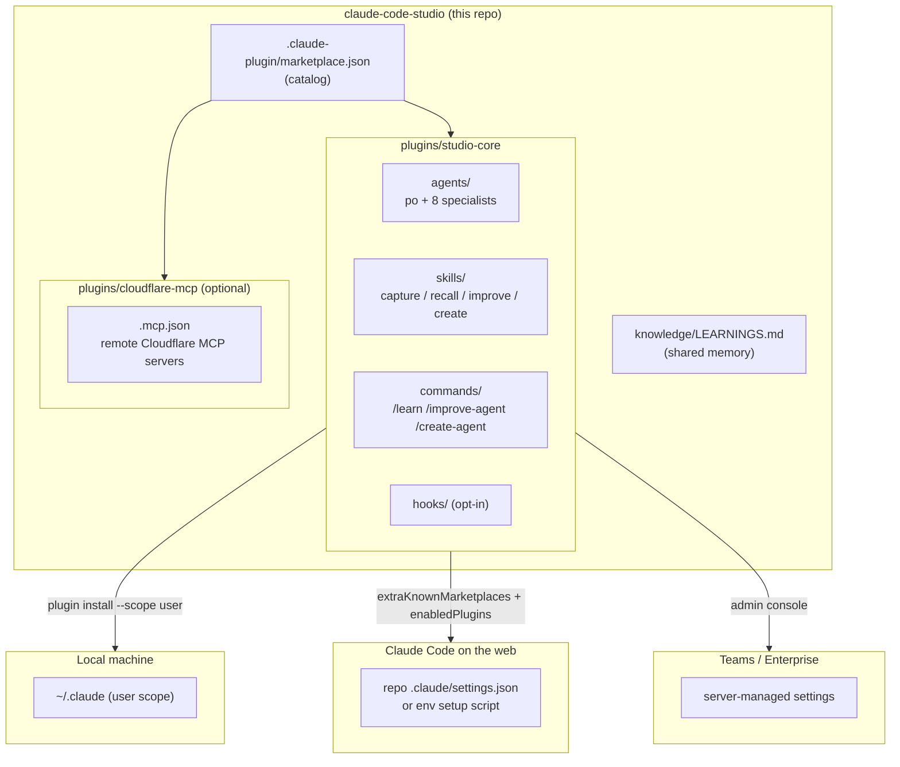
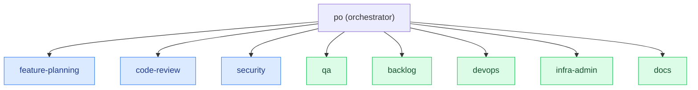
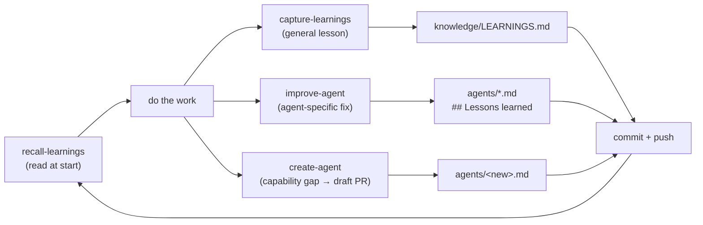

# Architecture

`claude-code-studio` is a **Git-hosted plugin marketplace** plus a **cross-project
learning system** for [Claude Code](https://code.claude.com). It has two jobs:

1. **Distribution** — author agents, skills, and commands once and load them in every
   environment (local and Claude Code on the web) with a single install.
2. **Incremental learning** — let those agents and skills accumulate knowledge across
   projects, both as shared notes and as changes baked into the agents themselves.

## Design constraints

The whole design follows from one fact about Claude Code on the web: **cloud containers
are ephemeral and clone the repo fresh, and user-level `~/.claude` does not persist.**
So the only reliable cross-environment channels are (a) files committed to a repo and
(b) a git-hosted marketplace referenced from a repo's `.claude/settings.json`. Personal
`~/.claude/agents` and `~/.claude/skills` are therefore *not* the sharing mechanism —
everything shippable lives inside the versioned `studio-core` plugin.

## System overview



The catalog publishes two plugins. `studio-core` is the one that matters here: it
bundles agents, skills, commands, and (opt-in) hooks, and everything below describes
it. `cloudflare-mcp` is an optional add-on that carries only remote MCP server
declarations — no agents, skills, or learning-loop involvement — and exists to prove
the same distribution channel works for MCP config. Consumers reach either plugin the
same three ways depending on account and environment; see
[`deploy-org-wide.md`](deploy-org-wide.md).

## Agent orchestration

`po` (Product Owner) is the orchestrator. It receives a goal, reads project context,
and delegates to specialist agents via the `Agent` tool. Specialists are tiered by the
model their work needs.



Judgment-heavy work (blue) runs on a Sonnet-tier model; mechanical/structured work
(green) runs on a Haiku-tier model, to keep token spend low.

## The incremental-learning loop



- **recall-learnings** reads relevant prior lessons before work starts (matches on
  `Trigger` keywords).
- **capture-learnings** (`/learn`) writes general lessons to the shared
  `knowledge/LEARNINGS.md`.
- **improve-agent** (`/improve-agent`) bakes a behavioral fix into a specific agent's
  own definition, so the correction travels in its prompt.
- **create-agent** (`/create-agent`) scaffolds a new specialist for a recurring gap and
  opens a **draft PR** — never merged unattended.
- Everything is a file change under `plugins/studio-core/` or `knowledge/`, so it
  propagates to every environment on the next `marketplace update` (local) or fresh
  session (cloud).

`po`'s "Learning cycle" routes automatically: agent-behavior → `improve-agent`,
general → `capture-learnings`, capability gap → `create-agent`.

### Capturing from another environment

The write-back scripts assume you're inside a checkout of this repo. When the plugin is
installed in **another project** (or a cloud session) the repo isn't checked out and the
`knowledge/` base isn't on disk, so `capture-learnings` and `improve-agent` fall back to
`plugins/studio-core/scripts/push_to_studio.sh`, which clones the public studio repo to a
temp dir, applies the entry with the repo's own append scripts, pushes a branch, and
opens a draft PR. That way a lesson learned anywhere still lands back in the studio and
redistributes on the next update.

## Repository layout

```
.claude-plugin/marketplace.json      Marketplace catalog (lists both plugins)
plugins/studio-core/                 The main distributable plugin
  .claude-plugin/plugin.json         Plugin manifest
  agents/                            po + 8 specialists + example template
  skills/                            capture / recall / improve / create + example
  commands/                          /learn, /improve-agent, /create-agent
  hooks/                             opt-in hooks (hooks.json ships empty)
  scripts/push_to_studio.sh          write-back from outside a studio checkout
plugins/cloudflare-mcp/              Optional add-on: remote Cloudflare MCP servers
knowledge/LEARNINGS.md               Shared, version-controlled cross-project memory
.claude/settings.json                Loads the plugins into THIS repo's own sessions
templates/                           Copy/paste settings blocks for other repos
scripts/                             install-local, update-studio, enable-in-repo,
                                     sync-learnings
docs/                                deploy-org-wide, updating, architecture
```

## Trust & safety notes

- Agents and skills contain **no secrets**; the plugin ships `hooks.json` empty so
  nothing runs or writes without the user asking.
- `knowledge/LEARNINGS.md` holds **generalized** lessons only — no project-identifying
  or confidential detail.
- `create-agent` and `improve-agent` changes always land through a **PR**, never
  directly on `main` unattended.
